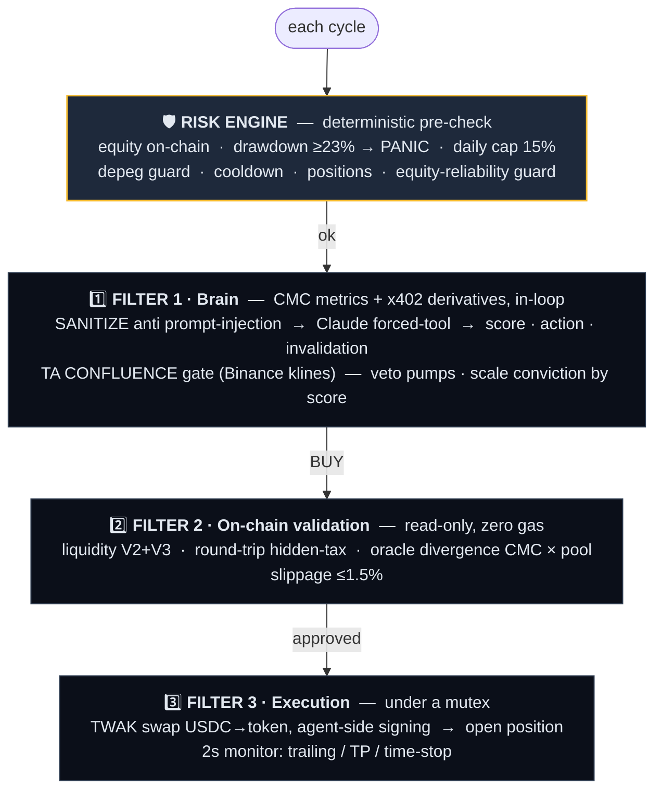
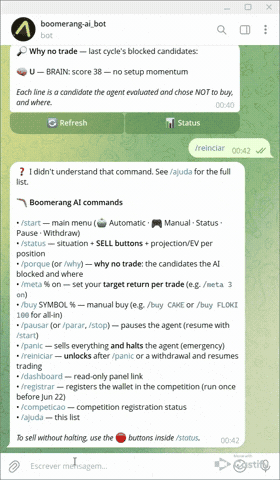

<div align="center">

# 🪃 Boomerang AI

### An autonomous, self-custody crypto trading agent on BNB Chain — controlled from Telegram, verifiable on-chain.

It reads attention on **CoinMarketCap**, decides with **Claude (Opus 4.8)**, and signs its own
self-custody swaps via the **Trust Wallet Agent Kit**. Capital *goes to the market and comes
back* — like a boomerang.

[](.github/workflows/ci.yml)
[](https://dorahacks.io/)
[](https://bscscan.com/address/0x8004A169FB4a3325136EB29fA0ceB6D2e539a432)
[-0ea5e9)](#-security--verifiability)
[](LICENSE)

**🌐 Live:** https://boomerang-ai-production.up.railway.app · runs 24/7, controlled from Telegram.

</div>

---

## Why it's different

Most "AI trading agents" are a prompt with a swap bolted on, a backtest, or a mock that never
moves money. Boomerang AI is the opposite on every axis:

- 🤖 **Actually autonomous & live.** Runs 24/7 on Railway, scans the real market, decides, and
  signs its own transactions — no human in the loop.
- 🔐 **Real self-custody.** The key never leaves the agent; the bot and website have **no access**
  to it. A *separate, fund-less* wallet signs the on-chain proofs, so frequently-used keys can
  never move money.
- 🧠 **A real brain, guarded by deterministic code.** Claude Opus 4.8 scores setups; **the code**
  decides the action, size, stops, and kill-switches. An LLM hallucination cannot bypass risk.
- 🎯 **A multi-strategy engine, not one trick.** Momentum, mean-reversion and DCA, *routed by
  market regime* — with a position-size action matrix and an expectancy arbiter that
  auto-disables a bleeding strategy.
- ⛓️ **Verifiable on-chain.** ERC-8004 identity + **live attestation**: every trade's reasoning
  (and its falsifier) is sealed on-chain **before** the outcome exists. Anti-fabrication by design.
- 💸 **x402 pay-per-call, load-bearing in the loop.** The agent pays real USDC micropayments on
  Base — signed locally via TWAK — for premium CMC data, as part of the trade cycle.

---

## On-chain proof (mainnet, verifiable)

Everything the agent claims is auditable on-chain. Trade wallet `0xc72a37f4bb7c454Fd8a9EB629aFaEeb101F67dff`.

| What | Proof |
|---|---|
| **Agent identity (ERC-8004)** | agentId **131071** · [registration tx](https://bscscan.com/tx/0x93b2d496350f23aafc0872e0d6e5b0d736d0cb76260fd33f957b79bbe8f66947) · registry `0x8004A169FB4a3325136EB29fA0ceB6D2e539a432` |
| **Live circuit-breaker attestation** | drawdown state sealed each cycle — [example tx](https://bscscan.com/tx/0xaa59abea6e67c1e715ae728562dc56aab412046e51032469933c571598265c11) |
| **x402 micropayment (real)** | $0.01 USDC settled on Base for CoinMarketCap data — [settlement tx](https://basescan.org/tx/0xd5b04f9e12610160aed646a703a28f3625adbcfff86d8e54fde7f6835a76a699) |
| **Sell (ADA → USDC)** | [tx](https://bscscan.com/tx/0x7f87dec9e271461b3f1205440cfa26f531da4671e6ad2380966aa3627311da21) |
| **Capital return to owner** | anti-drain transfer — [tx](https://bscscan.com/tx/0xbf751fefd833b17c8f37c98f1157b223576240298c8c0f6aec50c7e0a5ee2df9) |

Full lifecycle proven on-chain: **identity → buy → sell → return to owner → x402 → live attestation**.

---

## How it works

**Thesis — attention arbitrage + regime-routed strategies.** Exploit the lag between a spike in
retail attention on CoinMarketCap and the liquidity arriving on-chain. A regime router runs the
right play for the market; a deterministic trigger selects the setup and the brain confirms it.
Directional **spot** only. No leverage (derivatives funding is read as a *signal*, never traded).

### The strategy engine

| Strategy | Fires when (deterministic) | Exit |
|---|---|---|
| **Momentum** | uptrend regime · 1h>+2.5% · 24h>0% · rising volume | SL −1% → trailing 1.5% after +2.5% · 20-min time-stop |
| **Mean-Reversion** | range regime · short dip (1h<−2%) of a strong token (24h>+4%) | TP +2.5% (clears friction) · SL −0.8% |
| **DCA (crisis rebound)** | panic (F&G<25) · 24h<−10% · bounce started (1h>+0.5%) | TP +3% · no fixed SL (global breaker) · 24h time-stop |

On top sits an **Action Matrix**: the macro regime dictates *which strategies may open*, a
*size multiplier*, and a *max-positions* cap (RISK_OFF stands fully down; DEFENSIVE shrinks).
An **expectancy arbiter** auto-deactivates any strategy whose recent average PnL/trade goes
negative — even at high win-rate.

### TA confluence — it decides like a human trader

Before any buy, a deterministic **confluence engine** (`strategy/indicators.py` + `strategy/confluence.py`)
reads 1-minute candles from Binance and scores the setup across five pillars — **trend** (EMA, ADX,
slope), **momentum** (RSI, MACD), **volatility/mean-reversion** (Bollinger, Z-score, ATR), **volume**
(surge, OBV, VWAP) and **structure** (Fibonacci golden pocket). It weighs them **by regime** (trend vs
range), **vetoes chasing a vertical pump**, and only enters when enough pillars agree — producing a
human-readable checklist that's sealed on-chain. It's all in pure, unit-tested code (the LLM only
confirms the narrative). The `/live` page renders this live: an annotated candle chart (EMA · VWAP ·
Fibonacci) plus the confluence panel showing every signal, its vote, and the score.

### The "customs" pipeline — every cycle, three filters in series



Before executing, the agent **seals its reasoning + the invalidation condition on-chain**
(ERC-8004), gas-free — recorded before the outcome exists.

---

## 🎮 Control from Telegram

You **manage the agent entirely from Telegram** — it's the cockpit. The agent runs 24/7 on its
own and reports every action back to you; the public `/live` page and the `/console` demo are
read-only windows, not controls.

<p align="center">
  
</p>

<p align="center"><sub>Real screen recording of the owner control panel (<code>@boomerang_wallet_ai_bot</code>).</sub></p>

**Three surfaces, one cockpit:**

| Surface | Role | Controls the agent? |
|---|---|---|
| **Telegram** | your command panel + live alerts | ✅ owner-only (pinned to your user ID) |
| **`/live`** | public, read-only on-chain proof | ❌ no |
| **`/console`** | simulated demo ($100 fake wallet) | ❌ no |

**The flow:**

1. **Set up once** — `/start` → 🤖 *Automatic Mode* (pick tokens, stop, take-profit, size) → ▶️ *Activate*. Register the wallet for the competition with `/registrar`.
2. **It runs autonomously** — you get a Telegram alert on every trade (with PnL + BscScan link), every rejection, and every on-chain seal.
3. **Check in anytime** — `/status` (equity, drawdown, posture, positions with live PnL + **EV projection**, on-chain ID) · `/porque` (*why it did **not** trade*) · `/meta` (set your target return per trade).
4. **Take control when you want** — 🎮 *Manual Mode* / `/buy ETH` · 🔴 *Sell* buttons · `/pausar` · `/panic` (sell all + halt) · 🪃 *Withdraw*.

> Everything on `/live` is mirrored in Telegram, so you never need the web UI to operate — the bot is self-sufficient.

---

## Sponsor & ecosystem integrations

| Integration | Where | What it does |
|---|---|---|
| **CoinMarketCap** | `brain/cmc_analyzer.py` | market metrics (REST) + **x402 pay-per-call** to the Agent Hub for derivatives, in the trade loop |
| **Trust Wallet Agent Kit (TWAK)** | `vault/twak_executor.py` | the **only** execution layer — agent-side signing, swaps (V2+V3), approvals, x402 payments, anti-drain transfers (`--confirm-to`) |
| **BNB AI Agent SDK (ERC-8004)** | `boomerang/identity/` | verifiable **on-chain identity** (agentId 131071) + reasoning/risk attestation — gas-free via MegaFuel |
| **x402** | `payments/x402_cmc.py` + the live loop | real EIP-3009 USDC micropayments on Base, signed locally |
| **Claude (Anthropic)** | `brain/cmc_analyzer.py` | the decision brain (`claude-opus-4-8`) — forced tool output, deterministic action |

---

## 🔐 Security & verifiability

**Two separate wallets (least privilege).** The **trade wallet** holds the capital and executes
swaps; a **fund-less identity wallet** signs the ERC-8004 proofs. The money lives only in the
trade wallet — so the frequently-used, secret-resident identity key can never move a cent.

| Threat | Defense |
|---|---|
| Prompt injection | `sanitize_metrics` — numbers/labels only; the action is derived by **code** from the score |
| Bot hijack | `TELEGRAM_MASTER_USER_ID` pinning (any other id is silently ignored) |
| Key theft | encrypted keystores materialized from secrets + password; bot/site have no key access; password redacted in logs |
| Identity-key leak | identity wallet holds **no funds** — blast radius is fake metadata, not money |
| Sandwich / MEV | slippage cap + `amountOutMin` |
| Hidden tax / honeypot | round-trip retention check + curated eligible whitelist |
| Stale oracle / bad RPC | CMC × pool divergence + **skip-cycle on unreliable equity** (no false liquidation) |
| Stablecoin depeg | deviation guard blocks new entries |
| Catastrophic drawdown | deterministic circuit breaker (23%) + daily loss cap (15%), **attested on-chain** |

> 🔎 For a frank account of **what's real, what's a showcase, and the limitations**, read
> [`REVIEW.md`](REVIEW.md). For the full audit — threat model, verified defenses, severity-rated
> findings, and disclosure policy — see [`SECURITY.md`](SECURITY.md). The honesty is part of the engineering.

---

## Quickstart (local dev)

```bash
# Python
python -m venv .venv && .venv\Scripts\activate      # Windows (use source on Unix)
pip install -r requirements.txt

# TWAK CLI (self-custody execution + x402) — needs Node 18+
npm install -g @trustwallet/cli                      # the 'twak' CLI
twak wallet create --password "<STRONG_PASSWORD>"    # creates the encrypted keystore

# secrets
copy .env.example .env                               # fill in (see docs/SETUP.md)

# run
python run_agent.py --paper                          # paper mode: simulated, zero risk
python run_agent.py                                  # live (real funds)
```

Required `.env`: `ANTHROPIC_API_KEY`, `CMC_API_KEY`, `TELEGRAM_BOT_TOKEN`,
`TELEGRAM_MASTER_USER_ID`, `TWAK_ACCESS_ID`, `TWAK_HMAC_SECRET`, `WALLET_PASSWORD`,
`OWNER_WALLET_ADDRESS`. Hosted 24/7 → [`DEPLOY.md`](DEPLOY.md). Full credential walkthrough →
[`docs/SETUP.md`](docs/SETUP.md). Design → [`docs/ARCHITECTURE.md`](docs/ARCHITECTURE.md).

---

## Engineering quality

- ✅ **94 tests + CI** over the safety-critical pure logic — risk engine (circuit breaker, sizing,
  trailing, time-stop), the anti-injection sanitizer, the strategy router/action-matrix/arbiter,
  the equity-reliability guard, and log-secret redaction. `ruff` + `pytest` run on every push.
- ✅ **Deterministic risk fully isolated from the LLM** — the model never touches money rules.
- ✅ **Reproducible builds** — pinned dependencies + lockfile.

```
boomerang/
  agent.py                  Orchestrator: scan loop, monitor loop, buy/sell/withdraw/panic
  brain/cmc_analyzer.py     Filter 1 — CMC metrics + Claude decision (anti-injection)
  strategy/playbook.py      Regime-routed strategies + action matrix + expectancy arbiter
  strategy/indicators.py    Pure TA library (RSI/MACD/EMA/ADX/Bollinger/VWAP/OBV/Fibonacci)
  strategy/confluence.py    Regime-weighted confluence engine (the trader's checklist)
  strategy/klines.py        Binance 1m candles (data-api.binance.vision, geo-unblocked)
  risk/risk_engine.py       Circuit breaker, daily cap, sizing, trailing, time-stop, cooldown
  vault/
    bnb_validation.py       Filter 2 — on-chain liquidity / slippage / tax / oracle checks
    twak_executor.py        Filter 3 — TWAK swaps, approvals, transfers, x402
  identity/bnb_agent.py     ERC-8004 identity + on-chain reasoning/risk attestation
  payments/x402_cmc.py      Real x402 pay-per-call client (SDK-signed)
  interface/telegram_bot.py Owner control (InlineKeyboards, MASTER_USER_ID pinning)
  webapp/                   Public site (landing, docs, live proof, demo console)
```

---

## Status & disclaimer

✅ **Live and operating** on BNB mainnet, deployed 24/7 on Railway, controlled from Telegram.
Identity, attestation, x402, and the full trade lifecycle are proven on-chain (see the proof table).

> Operates with **real funds**. Real financial risk. This is a research/competition tool, **not
> financial advice**. No tool guarantees profit — use only what you are willing to risk.

**License:** MIT — see [`LICENSE`](LICENSE).
