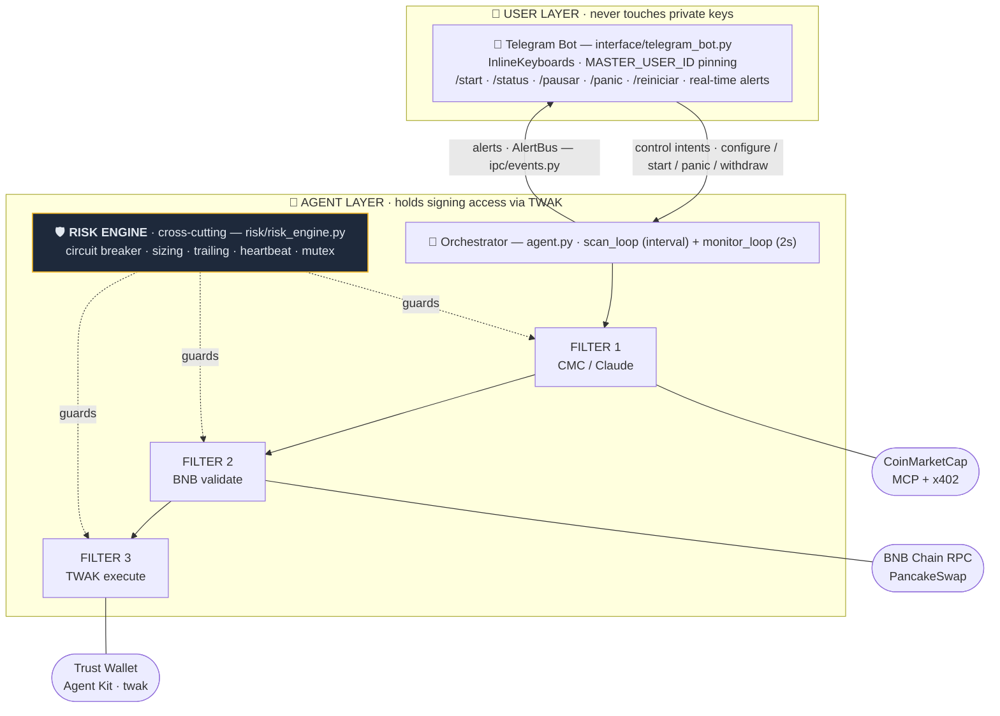
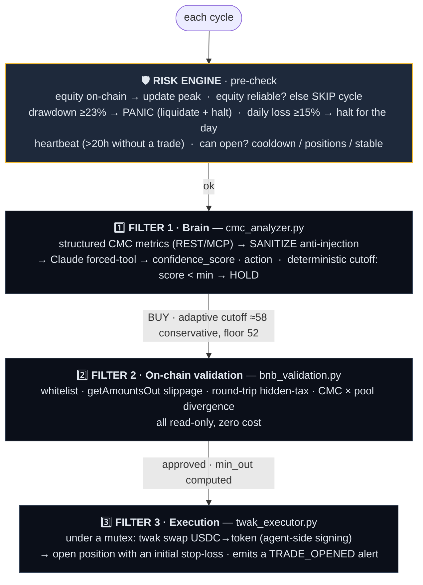
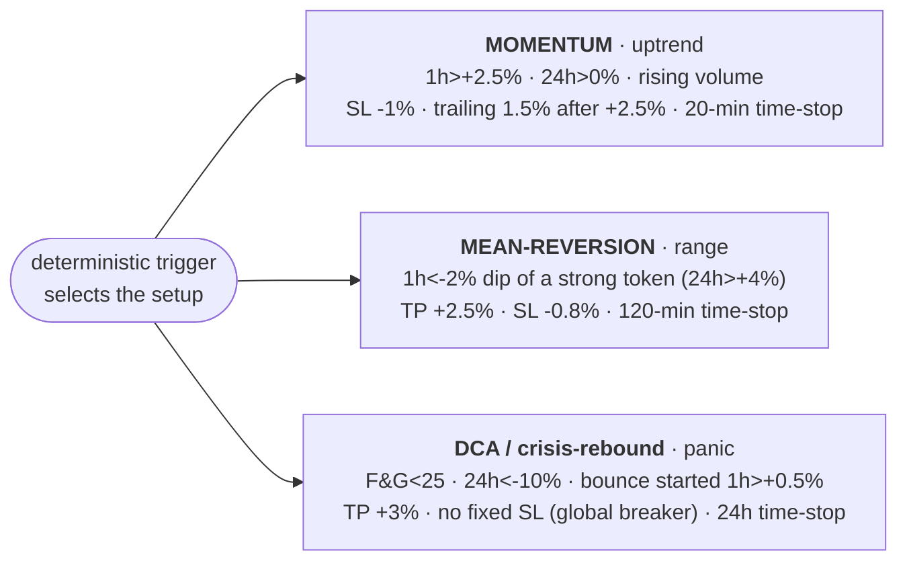
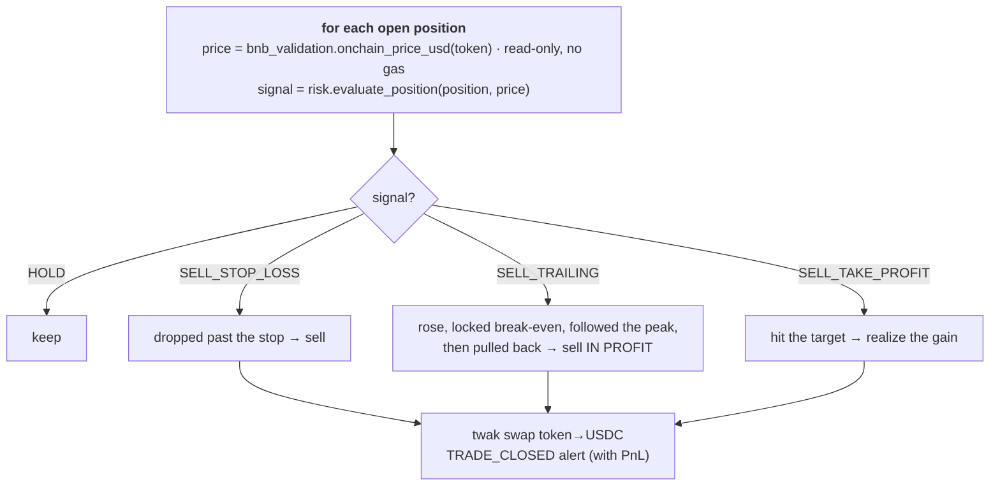
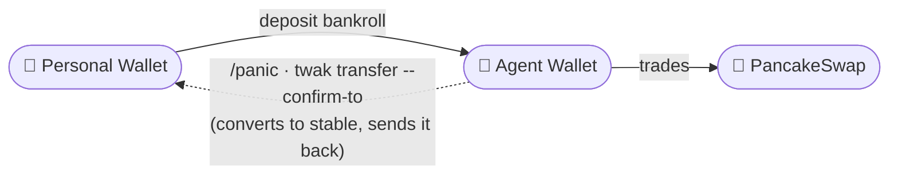

# 🪃 Boomerang AI — Architecture

Autonomous short-cycle trading agent on BNB Chain, controlled from Telegram.
Mapped to the project's real files.

---

## 1. Macro view — two layers, one container

**Isolation principle:** the bot/site (which talk to the internet) **never** access the
key. They only send *control intents* and receive *alerts*. The key lives in the
**encrypted keystore** of `twak`, on the agent side. (v1: in-process bus, a single
container in deployment; the seams allow real IPC between processes in the hardening
phase.)

> **Where it runs (deployment):** the official instance runs on **Railway**, agent + site
> in a single container. The encrypted keystore and the password live as protected
> provider environment variables (not in the repo or the image). Signing happens in the
> agent's environment, never in the browser/site. It remains **self-custody** (the agent's
> own wallet, withdrawals pinned to the owner), but the key does not stay "on your machine".

---

## 2. The lifecycle of a trade (the "customs")

Each scan cycle (`agent.run_cycle`) crosses three filters in series. A single rejection
aborts the trade **before** any money is touched.

---

## 2b. The multi-strategy engine (regime-routed)

Filter 1 is not a single rule. `boomerang/strategy/playbook.py` holds **three regime-routed
strategies**; a **deterministic trigger** selects the setup and the Claude brain only
**confirms** it (go/no-go + conviction). Each strategy carries its own exit parameters.

On top of the per-token trigger sit two deterministic governors:

- **Action Matrix** (`regime_posture`): the macro regime dictates *which* strategies may open,
  a **size multiplier** and a **max-positions cap** — RISK_OFF (BTC −5%) stands fully down
  (0.0× / 0 positions); DEFENSIVE shrinks to 0.6× / 2 positions; BULL runs 1.0× / 3.
- **Expectancy arbiter** (`expectancy_disabled`): auto-deactivates any strategy whose recent
  average PnL/trade is negative — even at a high win-rate — once enough trades have closed.

---

## 2c. The TA confluence engine (decides like a human trader)

Wired into Filter 1, before any buy executes, a deterministic **confluence engine** scores the
candidate the way a discretionary trader does — by *confluence* across pillars, **weighted by the
micro-regime** (trend vs range), not by one indicator.

- **`boomerang/strategy/klines.py`** — fetches 1-minute OHLCV from Binance's geo-unblocked public
  host (`data-api.binance.vision`); best-effort (on-chain-only tokens just skip the gate).
- **`boomerang/strategy/indicators.py`** — a pure, unit-tested TA library: EMA-cross, ADX, RSI,
  MACD, Bollinger %B, Z-score, ATR, VWAP, OBV, volume-surge, and **Fibonacci** (golden-pocket
  classification), plus `compute_indicators()` that returns the latest reading of all of them.
- **`boomerang/strategy/confluence.py`** — `evaluate_confluence()` turns those into per-pillar
  votes (trend / momentum / mean-reversion / volume / structure), **weights them by regime**,
  applies **hard vetoes** (never chase a vertical pump), and yields a decision (ENTER / WAIT /
  AVOID), a 0–100 score, and a **human-readable checklist**.

In `agent.run_cycle`, the gate **vetoes** AVOID candidates, **scales conviction** by the score, and
folds the confluence summary into the on-chain `commit_prediction`. The action is still derived **by
code**; the LLM only confirms the narrative. The public `/live` page renders the same analysis live —
an annotated candle chart (EMA · VWAP · Fibonacci golden pocket) + the confluence panel — and the
demo Console runs the identical engine on a simulated $100 bankroll.

---

## 3. The exit monitor (stop / trailing)

A parallel 2s loop (`agent.check_positions`), leveraging BSC's fast blocks:

---

## 4. The flow of money (the "boomerang")

- **Competition mode:** trades continuously, compounding the bankroll.
- **Boomerang (automatic return at cycle end):** a future/demo enhancement.
- **`--confirm-to`** pins the withdrawal destination = anti-drain shield.

**Two wallets, by design:**
- **Trade wallet** `0xc72a37f4bb7c454Fd8a9EB629aFaEeb101F67dff` — holds the funds and executes
  the swaps via twak. All the money lives here.
- **Identity wallet** `0xd06be7Cf5D097F13Dbf6C35943616EC21641abc9` — a **separate, fund-less**
  wallet that only signs the ERC-8004 on-chain proofs. It never touches custody, so attestation
  can never put the bankroll at risk.

---

## 5. The two layers of rules

| DEV layer (immutable, in code)             | USER layer (via Telegram)            |
|--------------------------------------------|--------------------------------------|
| eligible-token whitelist                   | token focus (liquid subset)          |
| global drawdown circuit breaker (23%/DQ 30%) | stop-loss (2% / 4% / 5%)           |
| daily loss cap (15% intraday)              | mode (conservative ≈58 / aggressive ≈52, adaptive, floor 52) |
| slippage cap (1.5%)                        | (per-trade size = % of equity, base 10%) |
| stablecoin depeg guard · dynamic SL/TP · trailing · time-stop | |
| anti-false-trip (skip on bad equity read) ·  destination lock (anti-drain) | |
| min trades / heartbeat · cooldown · anti-loop mutex | |

`config.json` = `dev_safety` + `hackathon` (locked) and `user` (tunable).

---

## 6. Security hardening (threat model → defense)

| Attack                          | Defense (file)                                     |
|---------------------------------|----------------------------------------------------|
| Prompt injection (news/social)  | sanitize_metrics — numbers/labels only (cmc_analyzer)|
| Bot hijack                      | MASTER_USER_ID pinning (telegram_bot)              |
| Sandwich / MEV                  | slippage + amountOutMin (bnb_validation)           |
| Hidden tax / honeypot           | round-trip retention (bnb_validation)              |
| Stale oracle ("falling knife")  | CMC×pool divergence (bnb_validation)               |
| Infinite loop / gas spam        | mutex + cooldown (risk_engine)                     |
| Stablecoin depeg                | depeg guard on the base stable (risk_engine)       |
| Bad equity read (RPC/price glitch) | anti-false-trip: SKIP the cycle instead of liquidating on bad data (risk_engine) |
| Key theft                       | encrypted keystore in twak; bot/site have no access; **identity wallet is fund-less** |
| Host exposure (cloud)           | secrets as protected env vars; never in repo/image; small bankroll bounds risk |
| Catastrophic drawdown / DQ      | deterministic circuit breaker (23%) + 15% intraday daily loss cap (risk_engine) |
| Fabricated reasoning / hindsight | on-chain attestation: commit_prediction seals the reasoning + falsifier BEFORE the outcome (identity/bnb_agent) |

---

## 7. Mapping to sponsors and prizes

- **CoinMarketCap (Agent Hub):** Filter 1 consumes data via REST/MCP. **x402 is now
  load-bearing in the trade loop** (not just a showcase): the agent pays a real USDC-on-Base
  micropayment (~$0.01, EIP-3009, ~1×/hour) for Agent Hub derivatives the REST plan blocks,
  and that data feeds the brain (best-effort, with a Binance-funding fallback)
  → competes for "Best Use of Agent Hub".
- **Trust Wallet (TWAK):** the single execution layer, multiple surfaces (signing +
  autonomous mode + x402 micropayments), self-custody → targets the "Best Use of TWAK" rubric.
- **BNB AI Agent SDK:** the agent's on-chain identity (ERC-8004, agentId 131071, gas-free via
  MegaFuel) **plus live attestation** — `commit_prediction` (seals each trade's reasoning +
  falsifier before the outcome), `publish_track_record`, and `publish_risk_state` (circuit-breaker
  state each cycle), signed by the fund-less identity wallet → "Best Use of BNB SDK".
- **Track 1 (PnL):** deterministic guardrails maximize return without breaching the
  drawdown that disqualifies.
